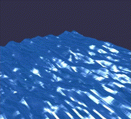

# Hi there 👋, I'm Aly Ashour
I'm a third year Computer Software Engineering student at Western University.  
I'm also founder and president of WE Autopilot club. Check us out on [our org page](https://github.com/WE-Autopilot).

- 🔭 I’m currently working on CVA & Recurse
- 🌱 I’m currently learning Go, C++, OpenGL

## 💻 Software Skills, Technologies, & Tools 🛠️


<br>


<!--START_SECTION:waka-->
📊 **This Week I Spent My Time On** 

```text
💬 Programming Languages: 
Rust                     1 hr 8 mins         ███████░░░░░░░░░░░░░░░░░░   28.85 % 
Other                    1 hr 1 min          ██████░░░░░░░░░░░░░░░░░░░   25.96 % 
Markdown                 39 mins             ████░░░░░░░░░░░░░░░░░░░░░   16.35 % 
SQL                      24 mins             ███░░░░░░░░░░░░░░░░░░░░░░   10.33 % 
Swift                    14 mins             ██░░░░░░░░░░░░░░░░░░░░░░░   06.26 % 

🔥 Editors: 
RustRover                1 hr 47 mins        ███████████░░░░░░░░░░░░░░   45.14 % 
iTerm2                   59 mins             ██████░░░░░░░░░░░░░░░░░░░   25.05 % 
VS Code                  40 mins             ████░░░░░░░░░░░░░░░░░░░░░   16.92 % 
Xcode                    16 mins             ██░░░░░░░░░░░░░░░░░░░░░░░   07.04 % 
CLion                    13 mins             █░░░░░░░░░░░░░░░░░░░░░░░░   05.84 % 

🐱‍💻 Projects: 
jarvis                   3 hrs 17 mins       █████████████████████░░░░   82.56 % 
Todo                     27 mins             ███░░░░░░░░░░░░░░░░░░░░░░   11.60 % 
cpp_leetcode             13 mins             █░░░░░░░░░░░░░░░░░░░░░░░░   05.83 % 
Unknown Project          0 secs              ░░░░░░░░░░░░░░░░░░░░░░░░░   00.02 % 
```


 Last Updated on 02/08/2025 18:50:13 UTC
<!--END_SECTION:waka-->

<h2>Some of what I've been working on...</h2>

I'm learning OpenGL!
This is my **[waves demo](https://github.com/alyashour/Gerstner-waves)** (made with geometric shaders!) and my **[marching cubes project](https://github.com/alyashour/Marching-Cube-Renderer)**.
<p>
  
  
</p>
