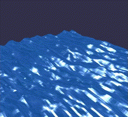

# Hello, I'm Aly Ashour
I'm a Software Engineering student at Western University.  
I'm also founder and president of WE Autopilot club. Check us out on [our org page](https://github.com/WE-Autopilot).

- 🔭 I’m currently working on Planning and Control of a self-driving car called AP1.
- 🌱 I’m currently learning Go, C, ROS2, and OpenGL.

Check out my website here: [alyashour.com](https://www.alyashour.com)

## 💻 Software Skills, Technologies, & Tools 🛠️


<br>

<!--START_SECTION:waka-->
📊 **This Week I Spent My Time On** 

```text
💬 Programming Languages: 
Other                    3 hrs 56 mins       ██████████████████░░░░░░░   71.23 % 
Go                       36 mins             ███░░░░░░░░░░░░░░░░░░░░░░   11.09 % 
Python                   25 mins             ██░░░░░░░░░░░░░░░░░░░░░░░   07.63 % 
Text                     11 mins             █░░░░░░░░░░░░░░░░░░░░░░░░   03.38 % 
Markdown                 9 mins              █░░░░░░░░░░░░░░░░░░░░░░░░   02.86 % 

🔥 Editors: 
iTerm2                   3 hrs 54 mins       ██████████████████░░░░░░░   70.70 % 
Neovim                   59 mins             █████░░░░░░░░░░░░░░░░░░░░   18.03 % 
VS Code                  37 mins             ███░░░░░░░░░░░░░░░░░░░░░░   11.27 % 

🐱‍💻 Projects: 
realsense-ros            1 hr 36 mins        ███████░░░░░░░░░░░░░░░░░░   28.96 % 
ap1                      1 hr 10 mins        █████░░░░░░░░░░░░░░░░░░░░   21.32 % 
ros-docker               1 hr 5 mins         █████░░░░░░░░░░░░░░░░░░░░   19.86 % 
prometheus-stack         47 mins             ████░░░░░░░░░░░░░░░░░░░░░   14.22 % 
ws                       37 mins             ███░░░░░░░░░░░░░░░░░░░░░░   11.27 % 
```


 Last Updated on 29/03/2026 19:07:16 UTC
<!--END_SECTION:waka-->

<h2>Some of what I've been working on...</h2>

I'm learning OpenGL!
This is my **[waves demo](https://github.com/alyashour/Gerstner-waves)** (made with geometric shaders!) and my **[marching cubes project](https://github.com/alyashour/Marching-Cube-Renderer)**.
<p>
  
  
</p>

And this is Autopilot1:  
<div style="overflow: scroll">
 
  
</div>


