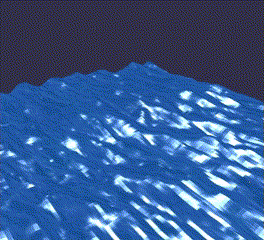

# Hello, I'm Aly Ashour
I'm a Software Engineering student at Western University.  
I'm also founder and president of WE Autopilot club. Check us out on [our org page](https://github.com/WE-Autopilot).

- 🔭 I’m currently working on Planning and Control of a self-driving car called AP1.
- 🌱 I’m currently learning ARM Assembly, Machine Learning, C, ROS2, and OpenGL.

Check out my website here: [alyashour.com](https://www.alyashour.com)

## 💻 Software Skills, Technologies, & Tools 🛠️


<br>

<!--START_SECTION:waka-->


📊 **This Week I Spent My Time On** 

```text
💬 Programming Languages: 
C++                      10 hrs 4 mins       ███████████████░░░░░░░░░░   60.45 % 
Astro                    2 hrs 39 mins       ████░░░░░░░░░░░░░░░░░░░░░   15.98 % 
Other                    59 mins             █░░░░░░░░░░░░░░░░░░░░░░░░   05.96 % 
C#                       57 mins             █░░░░░░░░░░░░░░░░░░░░░░░░   05.71 % 
CMake                    51 mins             █░░░░░░░░░░░░░░░░░░░░░░░░   05.13 % 

🔥 Editors: 
VS Code                  12 hrs 42 mins      ███████████████████░░░░░░   76.23 % 
Claude Code              2 hrs 58 mins       ████░░░░░░░░░░░░░░░░░░░░░   17.82 % 
iTerm2                   44 mins             █░░░░░░░░░░░░░░░░░░░░░░░░   04.45 % 
Neovim                   14 mins             ░░░░░░░░░░░░░░░░░░░░░░░░░   01.50 % 

🐱‍💻 Projects: 
strata                   12 hrs 17 mins      ██████████████████░░░░░░░   73.69 % 
alyashour.dev            3 hrs 8 mins        █████░░░░░░░░░░░░░░░░░░░░   18.87 % 
astra                    1 hr 6 mins         ██░░░░░░░░░░░░░░░░░░░░░░░   06.64 % 
imgui                    3 mins              ░░░░░░░░░░░░░░░░░░░░░░░░░   00.33 % 
SDL                      1 min               ░░░░░░░░░░░░░░░░░░░░░░░░░   00.19 % 
```

🤖 **AI Coding This Week** 

```text
⏱ AI Coding Time: 4 hrs 31 mins (27.09%)

✍️ 1,052 lines written by AI, 1,448 lines written by hand (42.08% AI-written)

🔤 584,181 Input Tokens, 203,854 Output Tokens

💵 $9.99 Estimated AI Cost This Week

🧠 19 AI Sessions, 94 AI Prompts

Sonnet                   1,270 lines         █████████████████████████   100.00 % 
Opus                     0 lines             ░░░░░░░░░░░░░░░░░░░░░░░░░   00.00 % 
Claude-Code              0 lines             ░░░░░░░░░░░░░░░░░░░░░░░░░   00.00 % 

🔎 AI Coding Insights:
⚖️ Balanced with AI — 42.08% of written lines came from AI
📝 Concise Prompter — average 198 characters per prompt
🔁 Iterative Prompter — average 5 prompts per session
🔍 Hands-On Reviewer — 63.13% of changed lines were hand-edited
```


 Last Updated on 17/08/2026 19:06:03 UTC
<!--END_SECTION:waka-->

<h2>Some of what I've been working on...</h2>

I'm learning OpenGL!
This is my **[waves demo](https://github.com/alyashour/Gerstner-waves)** (made with geometric shaders!) and my **[marching cubes project](https://github.com/alyashour/Marching-Cube-Renderer)**.
<p>
  
  
</p>

And this is Autopilot1:  
<div style="overflow: scroll">
 
  
</div>


