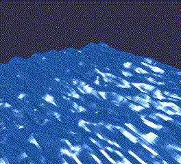

# Hello, I'm Aly Ashour
I'm a Software Engineering student at Western University.  
I'm also founder and president of WE Autopilot club. Check us out on [our org page](https://github.com/WE-Autopilot).

- 🔭 I’m currently working on Planning and Control of a self-driving car called AP1.
- 🌱 I’m currently learning ARM Assembly, Machine Learning, C, ROS2, and OpenGL.

Check out my website here: [alyashour.com](https://www.alyashour.com)

## 💻 Software Skills, Technologies, & Tools 🛠️


<br>

<!--START_SECTION:waka-->


📊 **This Week I Spent My Time On** 

```text
💬 Programming Languages: 
Python                   4 hrs 47 mins       ███████████░░░░░░░░░░░░░░   45.02 % 
HTML                     1 hr 31 mins        ████░░░░░░░░░░░░░░░░░░░░░   14.38 % 
Other                    1 hr 28 mins        ███░░░░░░░░░░░░░░░░░░░░░░   13.92 % 
JavaScript               1 hr 20 mins        ███░░░░░░░░░░░░░░░░░░░░░░   12.62 % 
Markdown                 1 hr 1 min          ██░░░░░░░░░░░░░░░░░░░░░░░   09.62 % 

🔥 Editors: 
VS Code                  6 hrs 57 mins       ████████████████░░░░░░░░░   65.32 % 
iTerm2                   1 hr 29 mins        ███░░░░░░░░░░░░░░░░░░░░░░   13.99 % 
Codex Vscode             1 hr 9 mins         ███░░░░░░░░░░░░░░░░░░░░░░   10.93 % 
Antigravity CLI          59 mins             ██░░░░░░░░░░░░░░░░░░░░░░░   09.31 % 
Neovim                   2 mins              ░░░░░░░░░░░░░░░░░░░░░░░░░   00.45 % 

🐱‍💻 Projects: 
SE4472                   3 hrs 46 mins       █████████░░░░░░░░░░░░░░░░   35.49 % 
lane_seg_transform       2 hrs 52 mins       ███████░░░░░░░░░░░░░░░░░░   26.96 % 
ap_rally                 2 hrs 20 mins       █████░░░░░░░░░░░░░░░░░░░░   21.92 % 
Lab 3                    1 hr 28 mins        ███░░░░░░░░░░░░░░░░░░░░░░   13.78 % 
Tasks                    6 mins              ░░░░░░░░░░░░░░░░░░░░░░░░░   00.99 % 
```

🤖 **AI Coding This Week** 

```text
⏱ AI Coding Time: 3 hrs 12 mins (30.08%)

✍️ 1,245 lines written by AI, 3,191 lines written by hand (28.07% AI-written)

🔤 1,200,019 Input Tokens, 145,056 Output Tokens

💵 $14.39 Estimated AI Cost This Week

🧠 13 AI Sessions, 117 AI Prompts

GPT                      1,264 lines         █████████████████████████   100.00 % 
Gemini                   0 lines             ░░░░░░░░░░░░░░░░░░░░░░░░░   00.00 % 

🔎 AI Coding Insights:
🧑‍💻 Mostly Hands-On — 28.07% of written lines came from AI
📚 Verbose Prompter — average 3,522 characters per prompt
🔁 Iterative Prompter — average 9 prompts per session
🔍 Hands-On Reviewer — 81.05% of changed lines were hand-edited
```


 Last Updated on 03/10/2026 21:38:17 UTC
<!--END_SECTION:waka-->

<h2>Some of what I've been working on...</h2>

I'm learning OpenGL!
This is my **[waves demo](https://github.com/alyashour/Gerstner-waves)** (made with geometric shaders!) and my **[marching cubes project](https://github.com/alyashour/Marching-Cube-Renderer)**.
<p>
  
  
</p>

And this is Autopilot1:  
<div style="overflow: scroll">
 
  
</div>


